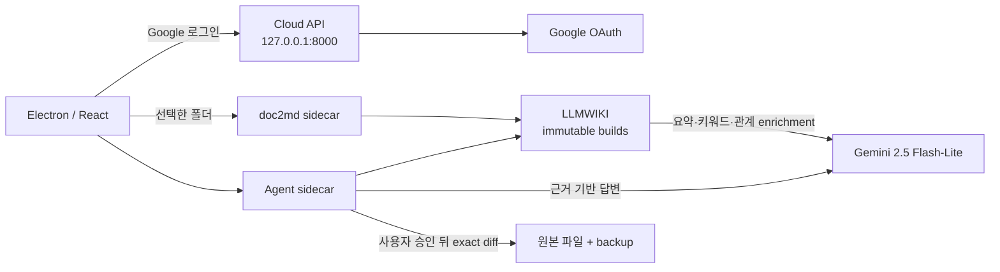

# CODEGATE 2026 통합 로컬 문서 에이전트

`dotenv-uploaded/codegate-2026-folding-song`의 `main`을 유일한 기준선으로 사용하는 monorepo다.
사용자가 선택한 로컬 문서를 Markdown으로 변환하고, 불변 LLMWIKI 색인을 만든 뒤, 근거가 있는
검색·질의와 **미리보기 → 승인 → 반영 → Undo** 방식의 수정을 제공한다.



## 구성

| 디렉터리 | 역할 |
|---|---|
| `codegate-2026-local` | Electron main/preload와 React UI, 폴더 감시, sidecar 감독 |
| `codegate-2026-convert` | PDF·Office·HWP/HWPX 등을 Markdown으로 바꾸는 `doc2md` API |
| `codegate-2026-agent` | 검색, Gemini 답변, 변경 계획, 승인·실행·Undo를 담당하는 FastAPI sidecar |
| `codegate-2026-backend` | Google OAuth cloud-api, LLMWIKI builder, 구형 local-runtime 계약 |

기계 기준선과 고정 런타임은 [`component-manifest.json`](component-manifest.json), 과거 유입
브랜치와 SHA는 [`UPSTREAM_SOURCES.md`](UPSTREAM_SOURCES.md)에 기록했다.

## 요구 사항

- Node.js 22.x
- pnpm 11.9.0
- `uv`
- Python 3.12
- macOS, Windows 또는 Linux 개발 환경

`doc2md`의 OCR 의존성과 모델은 용량이 크므로 첫 설치가 오래 걸릴 수 있다.

## 설치와 실행

```bash
pnpm setup
```

Codex의 신규 패키지 숙성기간 정책이 lockfile에 고정된 `kordoc` 설치를 막는 환경에서만, 검토한
lockfile 그대로 설치하도록 다음 명시적 옵션을 사용한다.

```bash
pnpm setup -- --allow-recent-packages
```

루트 [`.env`](.env)에서 아래 세 줄만 채운다.

```dotenv
GEMINI_API_KEY=...
CODEGATE_GOOGLE_CLIENT_ID=...
CODEGATE_GOOGLE_CLIENT_SECRET=...
```

나머지 설정과 64자리 session pepper는 이미 생성돼 있다. 그다음:

```bash
pnpm doctor
pnpm dev
```

`pnpm dev`는 다음을 한 번에 관리한다.

1. Google OAuth cloud-api를 `127.0.0.1:8000`에 기동한다.
2. doc2md를 빈 loopback 포트에 기동한다.
3. Electron 앱을 열고, 폴더 선택 뒤 Agent sidecar를 빈 loopback 포트에 기동한다.
4. Electron이 끝나면 자식 프로세스도 함께 종료한다.

## Google OAuth 설정

Google Cloud Console에서 OAuth 동의 화면을 만든 뒤 **Web application** OAuth client를 만들고,
아래 값을 `Authorized redirect URIs`에 경로까지 정확히 등록한다. 이 통합본은 사용자가 지정한 고정
callback과 client secret을 사용하는 web-server flow이므로 Desktop app client를 선택하면 안 된다.

```text
http://127.0.0.1:47821/auth/callback
```

앱은 PKCE와 `state`를 모두 검증한다. client secret과 session pepper는 로컬 cloud-api 프로세스에만
전달하고 Electron·doc2md·Agent sidecar 환경에서는 제거한다. 요청 scope는
`openid email profile`뿐이다.

OAuth consent 화면의 게시 상태가 `Testing`이면 로그인할 Google 계정을 test user로 등록해야 한다.
`redirect_uri_mismatch`가 나오면 client 유형과 URI의 scheme, host, port, path를 모두 다시 확인한다.

## Gemini와 문서 개인정보

모델은 `gemini-2.5-flash-lite`, thinking budget은 `0`으로 고정했다. 로컬 문서가 `internal`로
분류되므로 `.env`는 `CODEGATE_GEMINI_DATA_POLICY=paid-no-training`을 명시한다. 따라서
**결제가 연결된 Gemini API 프로젝트의 키**를 사용해야 한다. 이 정책을 제거하면 Agent는 내부
문서 내용을 Gemini에 보내지 않고 실패하도록 구현돼 있다.

첫 색인과 문서 변경 뒤에는 LLMWIKI가 Gemini로 요약·키워드·엔티티·문서 관계를 자동 보강한 뒤
새 후보 빌드를 만든다. 입력 SHA-256, 모델, 프롬프트와 스키마가 같으면 기존 승인 결과를 재사용해
불필요한 호출을 피한다. API 키가 설정된 상태에서 보강이 실패하면 새 후보를 공개하지 않아 기존
활성 빌드가 유지된다. 키가 없는 오프라인 개발·smoke 경로만 불완전 색인을 명시적으로 허용한다.

현재 `gemini-2.5-flash-lite`를 고정한다. 모델 수명 주기는 릴리스 전에 공식
[Gemini deprecations](https://ai.google.dev/gemini-api/docs/deprecations) 페이지에서 다시 확인해야
한다. 해당 페이지의 현재 표기는 이 stable 모델에 “No shutdown date announced”이며, 별도의
`gemini-2.5-flash-lite-preview-09-2025` 항목은 이미 종료된 preview로 구분되어 있다. 후속 모델로
이동할 때는 설정·가격·fingerprint·회귀 테스트를 함께 검증한다.

변경 요청에서 Gemini는 파일을 직접 쓰지 않는다. 대상 원본을 앱이 다시 읽어 SHA-256과 정확히 한
번 존재하는 기존 문구를 검증한 뒤 미리보기만 만들며, 실제 쓰기는 사용자가 승인한 plan hash에만
허용된다.

## 검증

```bash
# 모든 컴포넌트의 정적 검사, 단위 테스트, Electron 빌드
pnpm check

# 실제 원본 → 변환 → 위키 → 검색 → 승인 변경 → Undo 통합 경로
# 외부 LLM/OAuth를 호출하지 않는 deterministic fixture를 사용한다.
pnpm smoke
```

## 자주 막히는 지점

- `127.0.0.1:8000`은 cloud-api, `127.0.0.1:47821`은 OAuth callback 전용이다. 이미 사용 중이면
  해당 프로세스를 종료한 뒤 다시 실행한다. callback 포트나 경로를 임의로 바꾸면 Google Console
  등록값과 달라져 로그인할 수 없다.
- OCR 의존성 설치만으로 모델이 모두 준비되는 것은 아니다. 최초 실제 변환에서 최대 약 3.1GB의
  모델 다운로드가 발생할 수 있으므로 네트워크와 디스크 여유를 확인한다.
- `pnpm doctor`가 통과해도 실제 OAuth/Gemini 호출은 자격 증명·동의 화면·결제 프로젝트 상태에
  좌우된다. 첫 실행에서는 로그인과 작은 테스트 문서 질의를 각각 한 번 확인한다.

## 현재 의도적인 범위

- 문서 폴더는 한 번에 하나만 등록한다. 기존 UI가 여러 폴더를 보이면서 첫 폴더만 색인하던 결함을
  조용히 유지하지 않고, 충돌 없는 단일 workspace로 제한했다.
- 이 결과물은 소스 개발 실행본이다. Python sidecar와 OCR 런타임을 포함한 서명된 DMG/EXE 배포
  패키지는 별도 릴리스 작업이 필요하다.
- HWPX, DOCX, PPTX, XLSX, PDF는 API v2의 capability·preflight artifact·렌더 승인·적용·Undo·
  LLMWIKI 동기화 경계를 사용한다. `.hwp` 원본은 수정하지 않고 HWPX 파생본만 생성한다.
- 서명·암호화·macro/ActiveX/OLE 또는 지원 불명 OPC 구조는 fail-closed로 읽기 전용 처리한다.

## 개발 투명성

이 저장소는 AI 보조를 포함한 반복적인 설계·구현·검증 과정으로 개발했다. 기능의 현재 상태와
보안 경계는 README의 서술보다 `component-manifest.json`, 실제 sidecar 코드, 그리고
`codegate-2026-agent/tests/`의 테스트를 기준으로 판단해야 한다.
