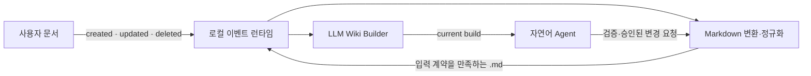

# LLMWIKI

사용자가 보유한 문서를 정규화 Markdown으로 변환하고, 검증 가능한 검색·인용 데이터와
LLM 생성 보조정보를 불변 위키 빌드로 만드는 팀 프로젝트다.

현재 저장소는 다섯 컴포넌트 사이의 계약과 LLM 위키 빌더 코어를 제공한다.

| 담당 영역 | 입력 | 출력 | 시작 문서 |
|---|---|---|---|
| Google OAuth·세션 | Electron PKCE 로그인 | CODEGATE access·refresh session | [Cloud API README](cloud-api/README.md) |
| Markdown 변환·정규화 | PDF, HWPX, DOCX 등 원본 | 입력 계약을 만족하는 `.md` | [Markdown 연동 가이드](docs/markdown-integration.md) |
| LLM 위키 빌더 | 정규화 Markdown | manifest, chunks, links, enrichment, 불변 build | [빌더 README](wiki-builder/README.md) |
| 자연어 Agent | 현재 위키 빌드와 사용자 명령 | 근거 기반 답변, 생성·수정 요청 | [Agent 연동 가이드](docs/agent-integration.md) |
| 로컬 이벤트 런타임 | created·updated·deleted POST | 변환·빌드 작업과 활성 상태 | [로컬 런타임 README](local-runtime/README.md) |

## 데이터 흐름



자세한 시스템 경계와 저장 구조는 [아키텍처 문서](docs/architecture.md)를 참고한다.
인증 경계와 Supabase를 사용하지 않는 결정은 [인증 결정](docs/authentication.md)에 기록한다.

사용자 PC에서 프론트가 원본 변경을 감지하는 구성은 `local-runtime`을 실행한다. 런타임은
SQLite에 이벤트를 기록한 뒤 `codegate-2026-convert`와 기존 `WikiBuildService`를 순서대로
호출하며, 새 빌드가 활성화된 경우에만 Markdown 입력 상태를 승격한다.

## 빠른 시작

Python 3.12와 [uv](https://docs.astral.sh/uv/)가 필요하다.

```bash
cd wiki-builder
cp .env.example .env
# .env에 GEMINI_API_KEY를 설정한다.
uv sync --extra dev
uv run python -m wiki_builder normalize
uv run python -m wiki_builder build
uv run python -m wiki_builder validate \
  --expectations tests/fixtures/sample-50.expectations.yaml
```

API 키가 필요한 실제 enrichment 실행 전에는
[`wiki-builder/README.md`](wiki-builder/README.md)의 데이터 정책을 먼저 확인한다.

## 검증

```bash
cd wiki-builder
uv run ruff check src tests
uv run pytest
```

CI는 외부 LLM API를 호출하지 않고 정적 검사와 테스트만 실행한다.

## 현재 범위

- Gemini 기반 enrichment와 검증
- 테넌트·위키 격리
- 내용 기반 불변 빌드와 current 포인터
- 문서 단위 재처리와 낙관적 동시성 제어
- 동일 문서 ID의 의미 청크 Markdown을 하나의 논리 문서로 결합하는 입력 모드
- 원문 보존, 접근 등급, 인용 근거 검증

GPT-5 nano 공급자 지원은 `OPENAI_API_KEY` 준비와 공급자 추상화 구현 후 추가할 예정이다.
현재 코드가 자동으로 OpenAI API를 호출한다고 가정하면 안 된다.

## 보안

- `.env`, API 키, `source-md/`, `wiki-storage/`, `llm-wiki/`는 커밋하지 않는다.
- 저장소에 포함된 샘플 문서와 enrichment는 합성 테스트 데이터다.
- 실제 내부 문서는 이 저장소에 커밋하지 않는다.
- 취약점과 키 노출 대응은 [SECURITY.md](SECURITY.md)를 따른다.

이 저장소는 현재 조직 내부 협업용이다. 라이선스와 외부 공개 정책은 별도 결정 전까지
외부 배포를 허용하지 않는다.
