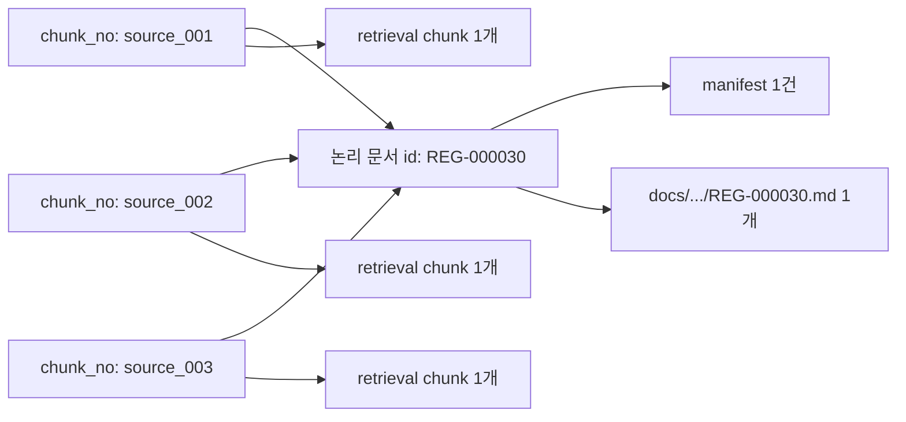

# 아키텍처

## 목적

사용자 로컬의 원본 문서에서 정규화 Markdown과 검증 가능한 위키 파생 데이터를 생성하고,
자연어 Agent가 이를 검색·인용하거나 문서 변경 요청에 활용할 수 있게 한다.

## 컴포넌트 경계

### 0. Cloud 인증 API

- Google OAuth Authorization Code + PKCE 로그인 시작과 code 교환을 담당한다.
- Google ID token을 검증한 뒤 Google token은 저장하지 않고 자체 opaque session을 발급한다.
- OAuth state·nonce의 1회성, loopback redirect allowlist, refresh rotation을 강제한다.
- 사용자 계정과 향후 구독·권한은 cloud 경계에 두고 로컬 파일 권한과 분리한다.

### 1. 로컬 이벤트 런타임

- 프론트의 `created`, `updated`, `deleted` POST를 localhost에서 받는다.
- 이벤트·작업·원본 버전을 SQLite와 SHA-256 캐시에 기록한다.
- 생성·수정은 로컬 `codegate-2026-convert` API에 전달하고 삭제는 변환 없이 처리한다.
- 후보 Markdown 입력에서만 변경한 뒤 빌드가 활성화된 경우에만 입력 상태를 승격한다.
- 실패한 후보는 폐기하고 기존 `current.json`과 활성 입력을 유지한다.

### 2. 문서 저장·변환 서비스

- 사용자 원본은 이동하거나 수정하지 않고 로컬 SHA-256 캐시에 버전을 보존한다.
- 원본 SHA-256을 계산한다.
- PDF, HWPX, DOCX 등을 UTF-8 Markdown으로 변환한다.
- `source-document.schema.json`과 본문 구조 계약을 만족시킨다.
- 의미가 다른 부분을 별도 Markdown으로 나눈 경우 같은 `id`와 고유 `chunk_no`를 기록한다.
- 완성된 Markdown 디렉터리를 원자적으로 게시한다.

### 3. LLM 위키 빌더

- Markdown 계약과 본문 보존을 검증한다.
- 같은 `id`의 의미 청크 파일을 하나의 논리 문서로 결합하되 각 파일을 검색 청크 하나로
  유지한다.
- 문서·섹션 식별자와 인용 앵커를 생성한다.
- manifest, chunks, aliases, links를 결정적으로 생성한다.
- 허용된 문서만 외부 LLM에 보내 enrichment를 생성한다.
- 모델 출력을 원문 근거와 JSON Schema로 검증한다.
- 내용 기반 불변 build를 생성하고 `current.json`을 조건부 교체한다.

빌더는 업로드, 사용자 인증, 검색 HTTP API와 자연어 편집 승인을 담당하지 않는다.

### 4. 자연어 Agent

- 인증된 사용자와 테넌트 범위 안에서만 current build를 조회한다.
- enrichment를 검색 후보 생성에 사용하고 원문 chunks로 사실을 재확인한다.
- 주요 사실마다 문서 ID, revision, section을 인용한다.
- 문서 생성·수정은 구조화된 변경 요청으로 변환한다.
- 현재 `build_id`를 함께 전달해 오래된 변경의 덮어쓰기를 방지한다.

## 저장 구조

```text
wiki-storage/
└── tenants/{tenant_id}/wikis/{wiki_id}/
    ├── current.json
    ├── enrichment/
    ├── builds/build-{content-hash}/
    │   ├── build-meta.json
    │   ├── docs/
    │   ├── manifest.jsonl
    │   ├── retrieval/
    │   └── schemas/
    └── audit/builds/
```

build 디렉터리는 생성 후 수정하지 않는다. 문서 삭제도 새 build를 만들며 이전 build의
보존·완전 삭제 기간은 상위 서비스 정책으로 관리한다.

## 문서와 의미 청크의 관계



`id`는 문서 단위 식별자이고 `chunk_no`는 그 문서 안의 원본 의미 조각 식별자다. 빌더는
`chunk_no`를 자연 정렬하며 조각 본문을 재청킹하지 않는다. 조각 파일의 해시와 경로는
manifest의 `ingest.fragments` 및 각 chunk의 `source_*` 필드에 보존된다. 이 계약을 도입한
불변 빌드 형식은 `server-v2`다.

## 동시성

Agent 또는 문서 서비스는 작업 시작 시 current `build_id`를 기록한다. 새 build 활성화 시
이를 `expected_current_build_id`로 전달한다. 현재 값이 바뀌었다면 활성화는 실패하고 호출자는
최신 문서 기준으로 변경을 다시 계산해야 한다.

현재 파일 잠금과 이벤트 워커는 사용자 PC의 단일 로컬 런타임을 전제로 한다. 여러 런타임이나
객체 저장소 구성에서는 DB lease 또는 ETag 기반 조건부 갱신 어댑터가 필요하다.

## 신뢰 경계

- Google 로그인은 시스템 브라우저에서 수행하고 callback은 임의 loopback 포트로만 받는다.
- Cloud API는 Google token을 보관하지 않으며 자체 session token 원문도 DB에 저장하지 않는다.
- 경로·테넌트·위키 식별자는 localhost 런타임의 신뢰된 설정이 결정한다.
- 로컬 API는 loopback에만 바인딩하고 정확한 CORS Origin과 선택적 API 토큰을 사용한다.
- 원본 절대 경로는 설정된 허용 루트 안의 일반 파일만 받는다.
- 클라이언트는 `synthetic_corpus`나 실제 저장 경로를 선택할 수 없다.
- `restricted` 문서는 외부 LLM 전송을 차단한다.
- 검색 계층은 모든 결과 반환 전에 manifest의 `access`를 검사한다.
- 모델 생성 요약은 원문이 아니며 최종 인용 근거로 사용하지 않는다.
